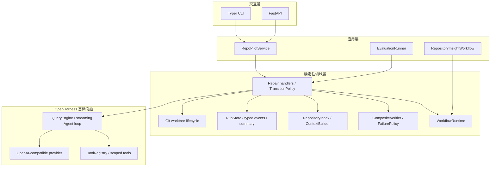
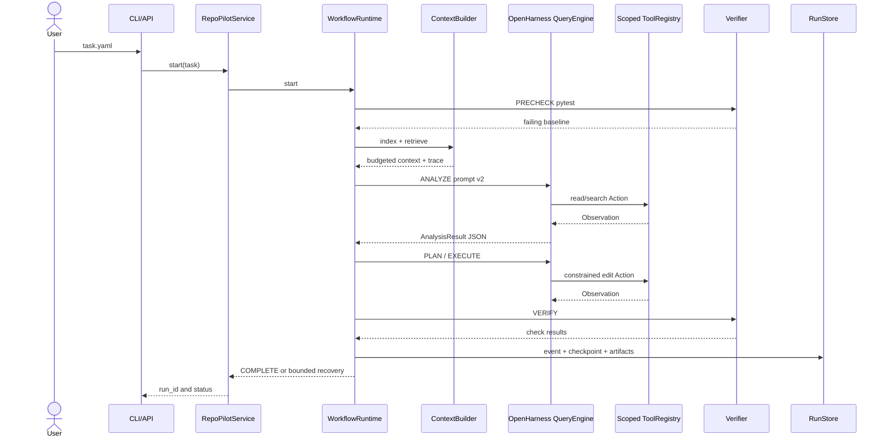

# RepoPilot 架构

## 分层

OpenHarness 负责通用 Agent 能力；RepoPilot 新增领域工作流、恢复政策、验证、
检索、worktree、持久化、评测和应用适配层。没有重写 QueryEngine、provider client
或 ToolRegistry。

## 修复时序

## 核心设计决定

1. 模型决策与工程控制分离：模型负责理解和编辑，状态转移、预算、权限和成功判定
   由代码负责。
2. 每个阶段创建独立模型 runtime，只传递 Pydantic 校验后的状态，减少长会话中的
   隐式状态和 Prompt 漂移。
3. 读阶段没有写工具，计划阶段没有工具，写阶段没有 shell；Prompt 是说明，
   ToolRegistry 和路径校验才是强制边界。
4. PRECHECK 和 VERIFY 使用真实 subprocess、参数数组、`shell=False`、超时和失败
   分类。模型不能自行宣布测试通过。
5. 每次状态转移后原子 checkpoint；事件写入失败会记录 warning，状态写入失败仍
   是致命错误。
6. worktree 保留原仓库，短哈希路径降低 Windows 路径长度风险；成功运行也不会
   静默删除，便于检查 diff。
7. Prompt 使用名称和版本，检索选择保存 trace，评测记录 run_id，保证结果可追溯。

## 关键源码入口

| 关注点 | 源码 |
|---|---|
| 通用工作流循环 | `src/openharness/repopilot/workflow.py` |
| 代码修复装配 | `src/openharness/repopilot/scheduler.py` |
| OpenHarness 模型阶段 | `src/openharness/repopilot/phase_runner.py` |
| 阶段工具边界 | `src/openharness/repopilot/tools.py` |
| 验证与失败恢复 | `verification.py`、`failures.py`、`policy.py` |
| 检索与上下文 | `retrieval.py`、`context.py` |
| 事件、状态与汇总 | `events.py`、`store.py`、`usage.py` |
| Git worktree | `workspace.py` |
| CLI / API | `cli.py`、`service.py`、`api.py` |
| 第二工作流 | `insight.py` |
| 评测 | `evaluation.py`、`examples/repopilot/evaluation/` |

## 明确边界

- 仅运行受信任的本地 Python 仓库；worktree 不等于容器沙箱。
- 不自动安装依赖、提交、合并或推送模型生成的代码。
- FastAPI 是单进程本地演示，重启后可读取持久化 run，但不会恢复进程内后台任务。
- 当前检索是词法检索；10 个 fixture 很小，不能外推到大型单体仓库。
- `RepositoryInsightWorkflow` 当前是确定性的引用报告器，不冒充模型质量评测。
